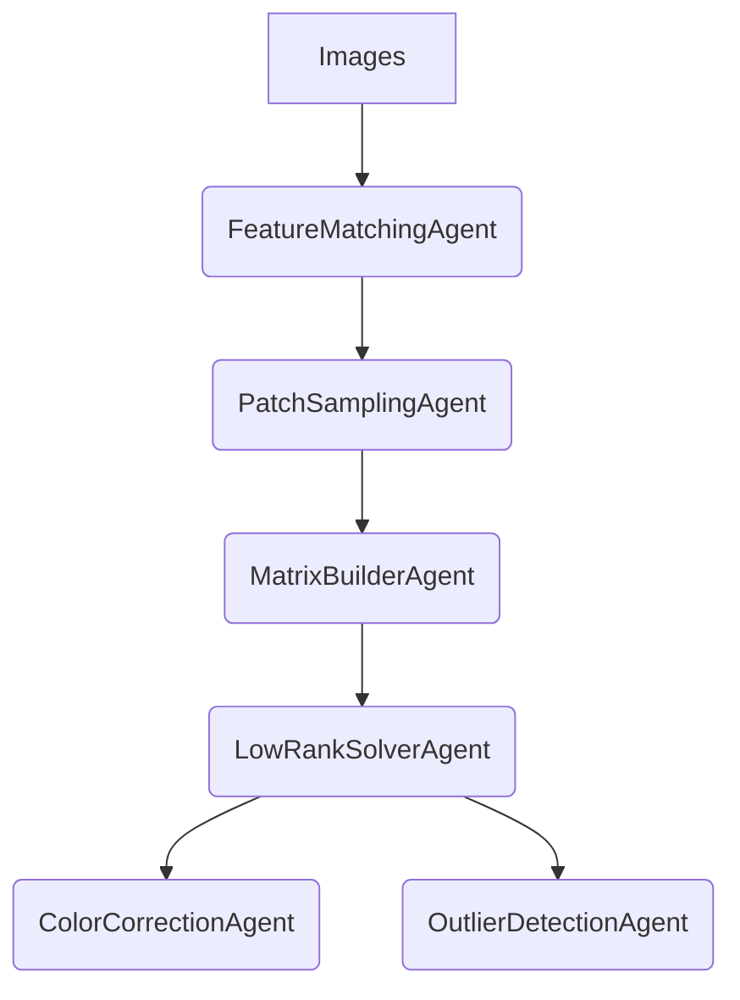

**复现论文：《Efficient and Robust Color Consistency for Community Photo Collections》**

---

## 🎯 项目目标代理（Project Agent Overview）

---

## 📦 Agent 列表与职责、公式说明

---

### 🧠 `FeatureMatchingAgent`

**职责**：提取图像特征并构建稀疏匹配图（用于后续像素观测构建）

**数学支持**：

* 使用 SIFT/DAISY 特征进行双向最近邻匹配；
* 构建图 G = (V, E)，用 Bron–Kerbosch 算法找最大团作为强鲁棒的像素对应组。

---

### 🔧 `PatchSamplingAgent`

**职责**：对齐 patch 并从中提取多像素增强样本

**补充解释**：

* 每个图像块大小固定为 30 \times 30，假设局部光照变化可控。
* 使用增强策略采样多个像素：图中 Fig. 4(e) 所示黄色为中心，橙色为扩展采样。

---

### 🧮 `MatrixBuilderAgent`

**职责**：构建稀疏观测矩阵 I \in \mathbb{R}^{m \times n} 与指示矩阵 W

**核心公式**：

* 对每个采样像素计算其对数强度：

I_{ij} = \log I_i(x_{ij})

* 构建掩码矩阵 W_{ij} = 1 当且仅当该像素在第 i 张图中被观测到。

---

### 📉 `LowRankSolverAgent`

**职责**：求解主观测矩阵的鲁棒 Rank-2 分解，提取伪白平衡 c_i 与伽玛系数 \gamma_i

**核心模型公式**：

* 原始图像生成模型：

I_i(x_{ij}) = (c_i a_j e_{ij})^{\gamma_i}

* 对数线性化后：

\log I_i(x_{ij}) = \gamma_i \log c_i + \gamma_i \log a_j + \gamma_i \log e_{ij}

* 构造：

I = C + A + E

其中：

* C_{ij} = \gamma_i \log c_i
* A_{ij} = \gamma_i \log a_j
* Rank(C + A) = 2（详见论文 Lemma 1）

---

**低秩矩阵建模**：

P = [\log c \odot \gamma, \gamma] \in \mathbb{R}^{m \times 2}, \quad
Q = [1, \log a] \in \mathbb{R}^{n \times 2}

目标变为：

\min_{P, Q} \| W \odot (I - PQ^\top) \|_1 + \frac{\lambda_1}{2} ( \|P\|_F^2 + \|Q\|_F^2 ) + \frac{\lambda_2}{2} \| Q - Q' \|_F^2

* 使用 ALM 方法优化（见论文 Eq. (8)）
* Q' 是预估 albedo 向量（基于像素中值 + 空间平滑）

---

### 🎨 `ColorCorrectionAgent`

**职责**：从 P 中提取参数后反向映射图像，实现色彩校正

**公式回顾**：

P = [\log c \odot \gamma, \gamma] \Rightarrow \text{可解得 } \gamma_i, \log c_i \Rightarrow c_i = e^{\frac{(P[:,0])}{\gamma_i}}

最终应用公式反向校正图像：

I' = ((I / c_i)^{1/\gamma_i})

每张图独立处理，可并行执行。

---

### 🚨 `OutlierDetectionAgent`

**职责**：利用残差矩阵检测阴影、饱和或误配区域

**公式定义**：

* 残差矩阵：

E = I - PQ^\top

* 按照前 10% 最大残差进行异常像素标注
---

## 🧩 调度图（Mermaid）

